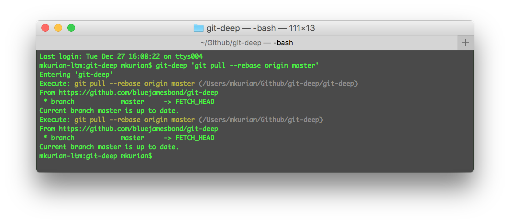

# Git Deep
Runs command on submodule (children) before running on parent git repo



```bash
yarn global add git-deep
```

## Examples
```bash
# Grunt commands
$ git-deep --parallel 'grunt watch'
$ git-deep 'grunt build'

# Git commands
$ git-deep 'git add .'
$ git-deep 'git commit -n -am "Added new features"'
$ git-deep 'git push'

# Or any other command
$ git-deep 'echo "foo bar"'
```

### Optional Arguments
- `-c, --childrenOnly`: Run command on children only
- `-p, --parallel`: Run commands in parallel

